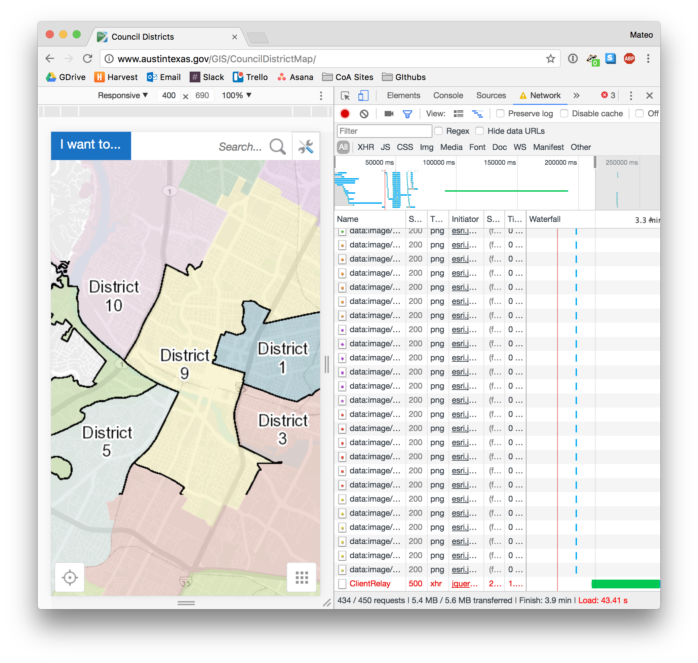

# Council District Map

This is an experimental map using **open source** web mapping tools.

The City currently uses ArcGIS for its 10-One Districting Map. It's good.

But... It takes a really long time to load and it is limited to the Esri standard theme.

On a 3G network, this map can take over a minute to load.

